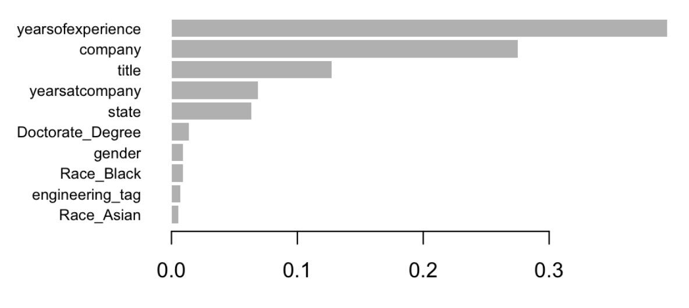

# RShinyDashboard_SalaryPredictions
This project utilizes a R Shiny Dashboard to create interactive visualizations based on salary, company, and job data. Visualizations include: mean and median salary at customized jobs and companies, salary over time (time series) for different jobs or companies, and an XGBoost predictive model for predicting salary given user inputs.
* Link for dashboard: https://crypticdreki.shinyapps.io/Salary_Expectations/

# Why?
Currently I am a graduate student who is near graduation. Our entire program is in the job market, which can be complex and confusing. A large part of finding jobs is also finances, and ensuring that a company is willing to pay you an accurate salary for your experience. I want students to be able to find out salary insights about their job and favorite companies.

* what insights am I looking for?
  
  * What companies pay more, and what jobs have higher salaries?
  
  * Are salaries changing, and in what direction?
  
  * How do different variables impact salary and is salary predictable?

# Data Used
The dataset was found on Kaggle called "Data Science and STEM Salaries" uploaded by Jack Ogozaly.
* link to the dataset: https://www.kaggle.com/datasets/jackogozaly/data-science-and-stem-salaries 

It was scraped from Levels.fyi and contained more than 62,000 salaries for a variety of job titles and companies. It also includes demographics such as race, sex, education; as well as years of experience in general and then more specifically at the particular company the job was at. This data was chosen due to its relevance to the Masters of Science in Business Analytics students and their job searching.

Minimal cleaning was done to the code. Some of the cleaning included ensuring company names were consistent. For example Microsoft could be found as: Mcsft, MircoS, microsoft, microsoft cmpy, and more. It was at this point that the top 25 companies with the most salary entries were chosen for model simplicity and cleaning effectiveness. It would be difficult to go through the 900 companies and ensure that there were no duplicates. So sadly the data was limited. In the future, I would try to expand this down to 50 companies as long as they still have enough entries for decent analytics. 

Job tags were also added in the form of dummy variables. The job tags seemed quite random, and similar to company names, the same job tag could have been said 20 different ways. So it was shortened to a few tags with the most entries.

# Code

* Code is broken into the XGBoost model creation and the R Shiny Dashboard creation. Since the mean/median bar plots and time series were all done fully within the dashboard server itself, they don't require an external section.

## XGBoost Model
XGBoost is machine learning program highly coveted for its predictive abilities. We used variables such as demographics, education, company and job info in order to predict the total yearly compensation; which includes salary and any bonuses given. For this project, the model was kept quite simple. However multiple arrangements of parameters were testing before landing upon what you can see in the code below. 

Data was randomly partitioned with 80% of the data going to training and 20% going to testing. This is so that there is enough data to create the model off of and still have a decent chunk left for testing. Another typical split is 60/40, however with data that's more variable, I opted for the larger training data size. 

Once you have data partitioned, XGBoost requires a specific data type, so the train and test data were converted accordingly with the dependent variable being totalyearlycompensation.

```r
# Data Partition
set.seed(7)  #setting seed for replicability
total_obs <- dim(model_data)[1] #Grabbing the number of rows. nrows() would also work here
train_data_indices <- sample(1:total_obs, 0.8*total_obs) #Here we see 80% of the rows being chosen for training.
train_data <- model_data[train_data_indices,] #The 80% of rows specified go into training data
test_data <- model_data[-train_data_indices,] #The test data gets everything else (20%)

# XGBoost data
dtrain <- xgb.DMatrix(data = as.matrix(train_data[, c(1:2, 4:ncol(train_data))]), label = train_data$totalyearlycompensation)
dtest <- xgb.DMatrix(data = as.matrix(test_data[, c(1:2, 4:ncol(test_data))]), label = test_data$totalyearlycompensation)

# XGBoost model
set.seed(111111)
bst <- xgb.train(data = dtrain, 
                 max.depth = 5, 
                 watchlist=list(train=dtrain, test=dtest), 
                 nrounds = 40)
```

I will preface by saying the goal of the XGBoost was to see variable importance, and its implementation into the dashboard as a predictive service was later added. If I were to go back and redo the model, I would spend more time on tuning parameters to get a higher accuracy and lower MAE and RSME.

First looking at variable importance utilized the following code:

```r
# Extract importance
imp_mat <- xgb.importance(model = bst) #defining the xgboost model named bst and getting variable importance
# Plot importance (top 10 variables)
xgb.plot.importance(imp_mat, top_n = 10) #plotting the top 10 on a graph
```


Years of experience, company, and title are the top 3. The higher the variable importance means the more impact that specific variable has on the outcome. In this case, that is predicted salary. These would make sense given common knowledge of the job market. And sadly race and gender made an appearance in the top 10 importance. There was discussion to remove race and gender from the model, however it is important to show that sadly these factors do impact salary.

The model had an accuracy of 91.2, a MAE of 53425.6 and a RSME of 131949.8. Sadly this would mean that on average, we are off on salary by a lot. Salary is so variable, so this is expected. That is why the focus was more aimed at variable importance than accuracy. However, I believed that the model would still be interesting for users to interact with so it was added to the dashboard.


## R Shiny Dashboard

The R Shiny Dashboard is broken into 3 panels consisting of: mean and median barplots, a timeseries, and an XGBoost preditive model. Each respective panel is discussed and explained within UI (user inferface) and Server code within the following sections.

### R Shiny UI Mean / Median

With hopes to show people what their mean or median salary can be at different positions with multiple companies, this panel was created. Within the UI side, the users are being asked to select their target companies and target positions. They are allowed to pick multiple from each category. Then the outputs of the graphs (created in the Server section) are displayed in a stacked format. This was done so that the users can directly compare the two graphs and perhaps see if certain companies have more outliers. Which can be derived from the difference between mean and median. Mean is more heavily impacted by outliers, so if it is higher than the median, you could draw the conclusion that sometimes there are outliers of a higher salary. But this is a simple visual and doesn't get too deep into analytics.

```r
    tabPanel("Mean Salary", sidebarLayout(   #mean salary
        sidebarPanel(
            selectInput("company_input", "Select company(s):", choices = c("All", unique(salaries$company)), multiple = TRUE),       #Company selection with multiple choices possible using the 25 companies with the most salary data found within the dataset
            selectInput("job_title_input", "Select job title(s):", choices = c("All", unique(salaries$job_title)), multiple = TRUE)     #Job title selection with multiple choices possible using the job titles found within the dataset that are by the 25 companies with the most data entries.
        ),
        mainPanel(
            plotOutput("salary_plot_mean"),
            plotOutput("salary_plot_median")
        )
    ))
```


### R Shiny Server Mean / Median

The server side is a bit more complicated. You have to intake all of the user input information and format it as reactive. So that as it changes, the server knows to rerun code and produce results based on the change.

```r
  # Create a reactive filtered dataset based on the user input
    filtered_salaries <- reactive({
        if ("All" %in% input$company_input & "All" %in% input$job_title_input) {
            return(salaries)
        }
        else if (!"All" %in% input$company_input & "All" %in% input$job_title_input) {
            return(salaries %>% filter(company %in% input$company_input))
        }
        else if ("All" %in% input$company_input & !"All" %in% input$job_title_input) {
            return(salaries %>% filter(job_title %in% input$job_title_input))
        }
        else {
            return(salaries %>% filter(company %in% input$company_input & job_title %in% input$job_title_input))
        }
    })
```
Now we use the reactive table from user inputs to create tables that are grouped by mean (or median for the next section). It then uses the aggregated data by company and job title to produce a bar plot with set scale. The scale is set so that the graphs are easily comparable to eachother and themselves with different information. If the scale were to change, \$300k could rise to the same place as \$400K did previously. So I avoided this problem by setting a scale.
```r
    # Reactive summary table based on the filtered data -- mean
    summary_table_mean <- reactive({
        filtered_salaries() %>% #only give the filtered salary info
            group_by(company, job_title) %>% #group by the two sections
            summarise(avg_salary = mean(salary), .groups = "keep") #summarize by mean
    })
    
    # Reactive plot from the summary_table_mean -- mean
    output$salary_plot_mean <- renderPlot({
        ggplot(summary_table_mean(), aes(x = job_title, y = avg_salary, fill = company)) +
            geom_bar(stat = "identity", position = "dodge") +
            labs(title = "Average Salary by Job Title and Company", x = "Job Title", y = "Average Salary") +
            ylim(0, 500000) + theme(panel.grid = element_blank())
    })
```
The median works the same as mean however it aggregates by median instead of mean. The same scale is present for this bar plot as well.
```r
    #Reactive summary table based on the filtered data-- median
    summary_table_median <- reactive({
        filtered_salaries() %>% #only give me the filtered salary info
            group_by(company, job_title) %>% #group by the two sections
            summarise(avg_salary = median(salary), .groups = "keep") #summarize by median
    })
    #Reactive plot from the summary_table_median -- median
    output$salary_plot_median <- renderPlot({
        ggplot(summary_table_median(), aes(x = job_title, y = avg_salary, fill = company)) +
            geom_bar(stat = "identity", position = "dodge") +
            labs(title = "Median Salary by Job Title and Company", x = "Job Title", y = "Median Salary") +
            ylim(0, 500000) + theme(panel.grid = element_blank()) })
```

### R Shiny UI Time Series

A time series of relevant companies or job title for salary was created to showcase variability of salary over time; as is a typical use of time series. Users may be interested to see if a company is keeping up with the salary standards over time, or if they remain consistent. The same can be seen for job titles, perhaps indicative of necessity and willingness of companies to pay more. One draw back from the time series is that you can only filter by company or job title independently, not together. My assumption for this error is lack of data. If the data is filtered down too much, there aren't enough data points for the time series. However, it may just be the reactive table and is something to look at in the future. It would be interesting to also add a forecast to the time series, in the future. However this would be harder because one model may work best for a specific job title but not another. 

```r
    tabPanel("Time Series Salary", sidebarLayout(   #time series
        sidebarPanel(
            selectInput("company_input_ts", "Select company(s):", choices = c("All", unique(salaries$company)), multiple = FALSE),
            selectInput("job_title_input_ts", "Select job title(s):", choices = c("All", unique(salaries$job_title)), multiple = FALSE)
        ), 
        mainPanel(
            plotOutput("ts_plot")
)))
```
### R Shiny Server Time Series
* Explain server side Time Series

```r
   # Create a reactive filtered dataset based on the user input for time series
    filtered_salaries_ts <- reactive({
        if ("All" %in% input$company_input_ts & "All" %in% input$job_title_input_ts) {
            return(salaries)
        }
        else if (!"All" %in% input$company_input_ts & "All" %in% input$job_title_input_ts) {
            return(salaries %>% filter(company %in% input$company_input_ts))
        }
        else if ("All" %in% input$company_input_ts & !"All" %in% input$job_title_input_ts) {
            return(salaries %>% filter(job_title %in% input$job_title_input_ts))
        }
        else {
            return(salaries %>% filter(company %in% input$company_input_ts & job_title %in% input$job_title_input_ts))
        }
    })
    
    # aggregate data by month
    monthly.data <- reactive({
        filtered_salaries_ts() %>%
            mutate(year_month = list(format(date, "%Y-%m"))) %>%
            group_by(year_month, company, job_title) %>%
            summarise(avg_salary = median(salary),  .groups = "keep")
    })
    
    # create time series object
    monthly.ts <- reactive({
        ts(monthly.data()$avg_salary, freq = 12, start = c(2020,7), end = c(2021,8))
    })
    
    # create plot
    output$ts_plot <- renderPlot({
        ggplot(data.frame(time = time(monthly.ts()), value = monthly.ts()), aes(x = time, y = value)) +
            geom_line() +
            xlab("Time") +
            ylab("Median Salary") +
            ggtitle("Median Salary Over Time by Company or Jobtitle") +
            ylim(0,500000) + theme(panel.grid = element_blank())
    })
```

### R Shiny UI XGBoost

For the XGBoost the user is given options to fill in with their information that are predictors for salary. For some of these, it was simple to just say the categories, for others such as company, which were factored for the model, had to be reversed. For categories such as Company and State, I referenced the data set before it was factored, factored it, and asked for the level names. So in server I could later match the name to the factored number and thus it could be used within the model. It was quite the roundabout way, but it worked the best for keeping the user-interaction simple. 

```r
 tabPanel("Salary Predictor", sidebarLayout(   #xgboost
        sidebarPanel(
            selectInput("job_tag", "Job Tag",  #job tag
                        choices = c("analytics", "finance", "engineering", "economics", "marketing", 
                                    "director", "UX", "mobile", "security", "production")),
            selectInput("education", "Education",  #education
                        choices = c("Masters_Degree", "Bachelors_Degree", "Doctorate_Degree", "Highschool", 
                                    "Some_College")),
            selectInput("job_title", "Job Title",  #job title
                        choices = levels(as.factor(final_data$title))),
            selectInput("company", "Company",      #company
                        choices = levels(as.factor(final_data$company))),
            selectInput("gender", "Gender",        #gender
                        choices = c("Male", "Female")),
            selectInput("race", "Race",         #race
                        choices = c("Asian", "White", "Two_Or_More", "Black", "Hispanic")),
            selectInput("state", "State",       #state
                        choices = levels(as.factor(final_data$state))),
            numericInput("years_of_experience", "Years of Experience", 0), #years experience
            numericInput("years_at_company", "Years at Company", 0), #years company
            actionButton("submit", "Submit"), #submit button
            # textOutput("predicted_salary")  #ayyy 
        ), 
        mainPanel(
            textOutput("predicted_salary")
        )
```
### R Shiny Server XGBoost

Using a submit button so that the computing is only once all information is in. Otherwise it would be predicting for information that is not input yet (the default) as the user is inputting information.

Taking the user inputs and transitioning it to the model variables was a bit of a challenge. As many of the options are categorical and need to be transitioned into factors or dummy variables. The dataframe called user_entry has variables identical to the ones used to create the model. Within this dataframe, the information from the user is changed into the factors or dummy variables. This makes it so that the user has simpler options and less drop downs to answer. However, in the future, more drop downs can be added for higher customization. Perhaps your ideal job description fits multiple job tags.

It then takes the user data frame and makes it identical to the the original model data frame. Then a predict function is done and saved so it can be output via the UI section. I chose to have it within some text because I feel it looks better than outputting just a number.

```r
    #XGBOOST
    # When the Submit button is clicked
    observeEvent(input$submit, {
        
        # Create the user input data frame
        user_entry <- data.frame(
            company = match(input$company, levels(as.factor(final_data$company))),
            title = match(input$job_title, levels(as.factor(final_data$title))),
            totalyearlycompensation = 0, #place holder
            yearsofexperience = input$years_of_experience,
            yearsatcompany = input$years_at_company,
            gender = ifelse(input$gender == "Male", 1, 0),
            Masters_Degree = ifelse(input$education == 'Masters_Degree', 1, 0),
            Bachelors_Degree = ifelse(input$education == 'Bachelors_Degree', 1, 0),
            Doctorate_Degree = ifelse(input$education == 'Doctorate_Degree', 1, 0),
            Highschool = ifelse(input$education == 'Highschool', 1, 0),
            Some_College = ifelse(input$education == 'Some_College', 1, 0),
            Race_Asian = ifelse(input$race == 'Asian', 1, 0),
            Race_White = ifelse(input$race == 'White', 1, 0),
            Race_Two_Or_More = ifelse(input$race == 'Two_Or_More', 1, 0),
            Race_Black = ifelse(input$race == 'Black', 1, 0),
            Race_Hispanic = ifelse(input$race == 'Hispanic', 1, 0),
            state = match(input$state, levels(as.factor(final_data$state))),
            analytics_tag = ifelse(input$job_tag == 'analytics', 1, 0),
            finance_tag = ifelse(input$job_tag == 'finance', 1, 0),
            analytics_tag = ifelse(input$job_tag == 'analytics', 1, 0), 
            finance_tag = ifelse(input$job_tag == 'finance', 1, 0), 
            engineering_tag = ifelse(input$job_tag == 'engineering', 1, 0), 
            economics_tag = ifelse(input$job_tag == 'economics', 1, 0), 
            marketing_tag = ifelse(input$job_tag == 'marketing', 1, 0), 
            director_tag = ifelse(input$job_tag == 'director', 1, 0), 
            UX_tag = ifelse(input$job_tag == 'UX', 1, 0), 
            mobile_tag = ifelse(input$job_tag == 'mobile', 1, 0), 
            security_tag = ifelse(input$job_tag == 'security', 1, 0), 
            production_tag = ifelse(input$job_tag == 'production', 1, 0),
            stringsAsFactors = FALSE
        )
        
        # Use the trained model to predict salary
        features <- names(model_data)
        user_entry <- user_entry[,features]
        colnames(user_entry) <- colnames(bst$model)
        user_entry <- user_entry[,c(1:2, 4:27)]
        user_test <- xgb.DMatrix(data = as.matrix(user_entry))
        prediction <- predict(bst, newdata = user_test)
        
        # Output the predicted salary
        output$predicted_salary <- renderText({
            paste0("Your predicted salary is: $", round(prediction, 2))
        })
```

# Findings

While this interactive adventure is supposed to be more personalized findings for a user, there were some overarching themes:

* More 'popular' and renowned companies pay higher salaries on average.

* Over time, salaries have gone up for a majority of companies and roles

* The salary prediction runs high As with 0 years of experience as a data analyst, the model believes I can earn around 114 thousand dollars a year. Sadly the high salaries seem a constant for the original data, and not the fault of the XGBoost model. However further tweaking could perhaps increase accuracy

* For the salary prediction there were variables that influence salary which shouldn't: such as gender and race. 

* The highest predictors of salary were job experience in general, company, job title, and job experience at the specific company. So if you are looking for a job, make sure you have the correct job experience and it matches what a company is looking for.
